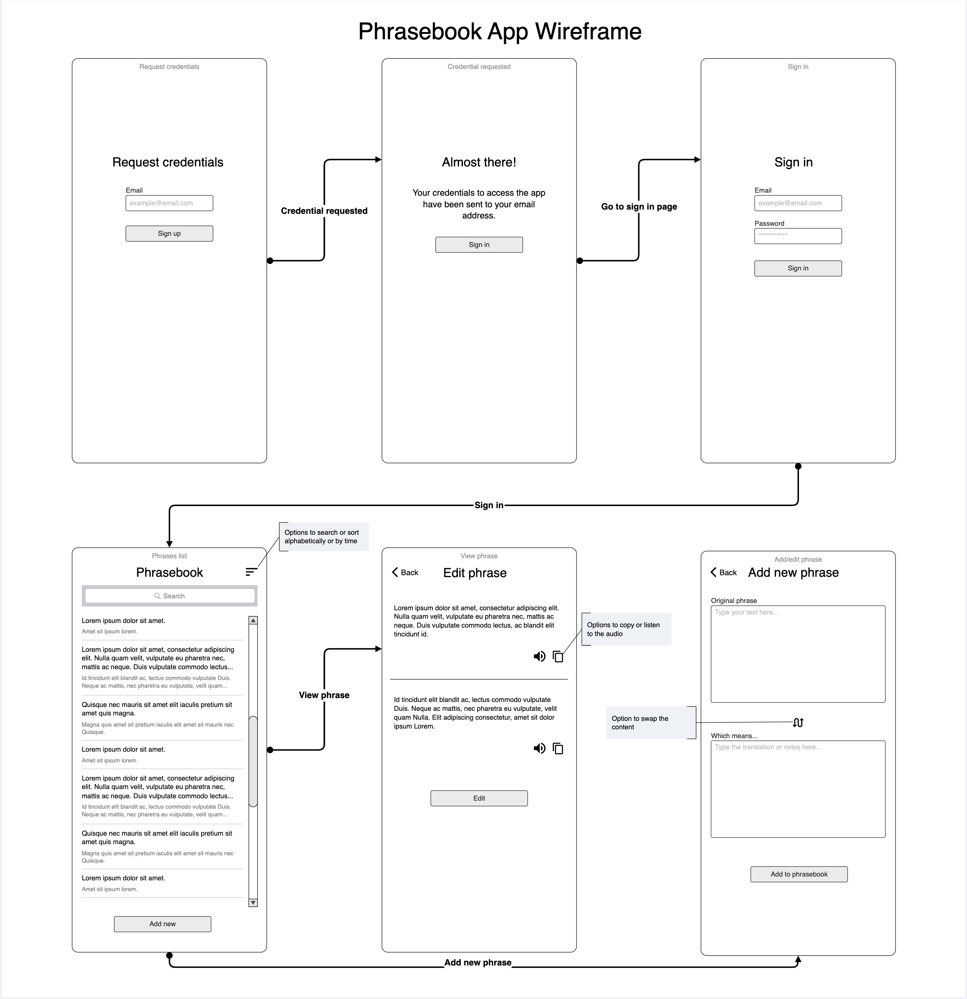

# Phrasebook App

The Phrasebook app is a web-based application that enables users to access a custom phrasebook, containing phrases they have created.

## API documentation

The API documentation is available at [this link](https://graziastracquadanio.github.io/phrasebook/openapi/dist/).

## Resources

### User

The user of the app owns the phrasebook and has exclusive access to it. The user is responsible for the content stored in the phrasebook app.

The user:

- creates phrases
~~- creates collections and add phrases to them~~ (v.2)

### Phrase

The phrase is a sentence of any length, accompanied by a note. ~~It can be part of one or multiple collections.~~ (v.2)

The phrase:

- can be added, edited or deleted by the user,
- ~~can be added or removed in a collection by the user,~~
- have a text body and other details, like a note.

### Collection

~~A collection is a group of phrases that share a common theme or purpose based on the user's criteria.~~ (v.2)

The collection:

- is added by the user,
- contains one or more phrases.

## Simple user stories

### Terms (entities)

- **User** : the person who uses the app.
- **Phrase** : a sentence, accompanied by other *details* (tbd).
- **Collection** : a group of phrases.

### Epic

As a user,  
I want to be able to consult a list of phrases that I previously saved,  
so that I can improve my language skills.

### User story: User account

As a user,  
I want to be able to have an account in the system,  
so I can use the service.

### User story: Add, edit, remove phrase

As a user,  
I want to be able to add, edit and remove a phrase with its relative details,  
so that I can consult it later.

### User story: Consult the list

As a user,  
I want to be able to consult the list of phrases,  
so that I can review it.

## Wireframe v1.0

The wireframe is available at [this link](https://app.moqups.com/YkcYUsHk3mhA7adK89hhK4qbxHpu5Tor/view/page/a880590a1?ui=0).